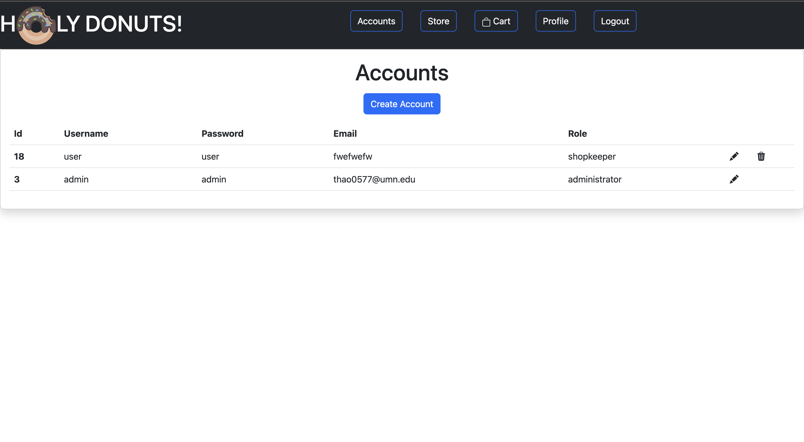
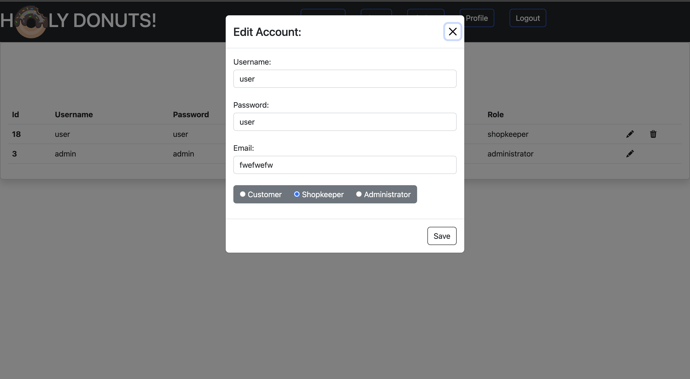
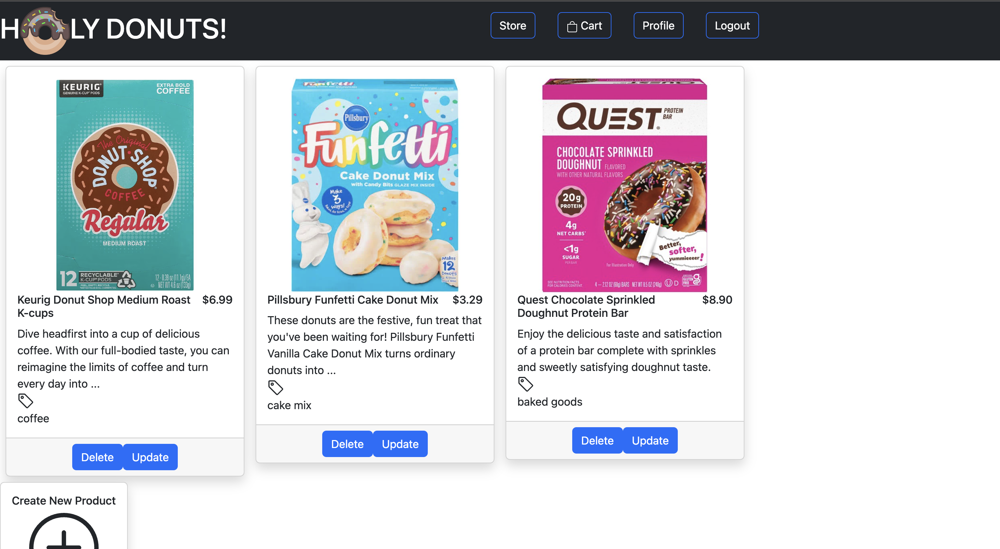
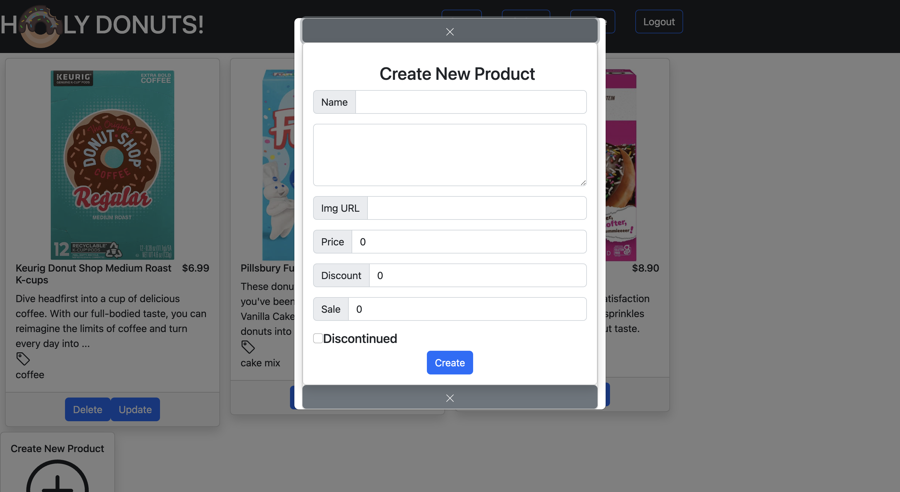
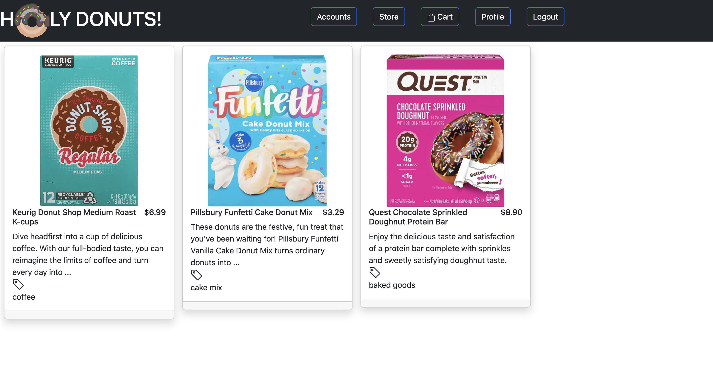
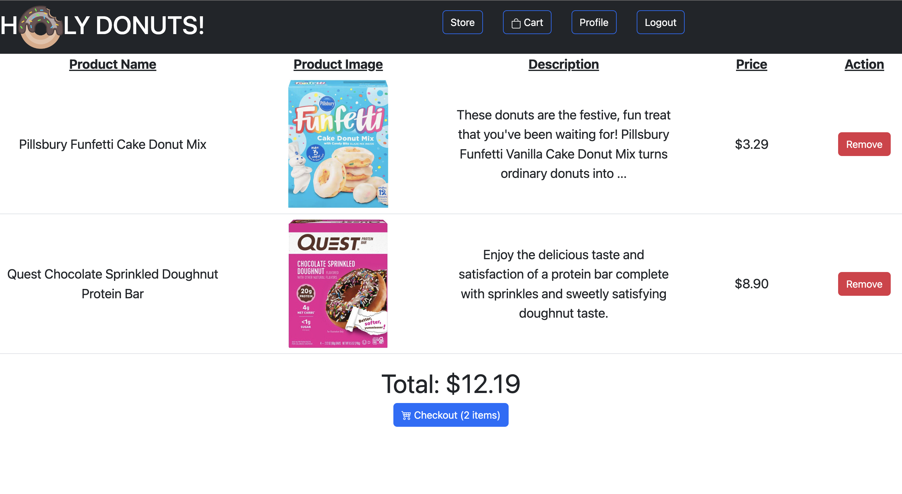
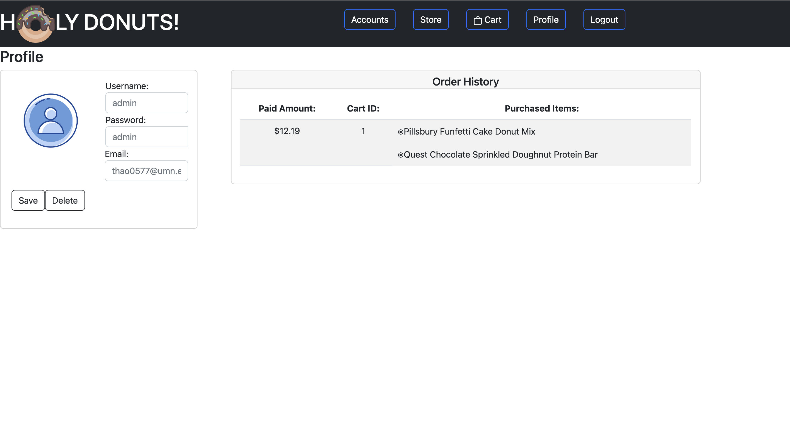

# TeamProjectFe

This project was generated with [Angular CLI](https://github.com/angular/angular-cli) version 14.2.8.
This is the frontend for the web application, the backend for it can be found at https://github.com/PMT13/holy-donuts-app-be

## Development server

Run `ng serve` for a dev server. Navigate to `http://localhost:4200/`. The application will automatically reload if you change any of the source files.

## Code scaffolding

Run `ng generate component component-name` to generate a new component. You can also use `ng generate directive|pipe|service|class|guard|interface|enum|module`.

## Build

Run `ng build` to build the project. The build artifacts will be stored in the `dist/` directory.

## Running unit tests

Run `ng test` to execute the unit tests via [Karma](https://karma-runner.github.io).

## Running end-to-end tests

Run `ng e2e` to execute the end-to-end tests via a platform of your choice. To use this command, you need to first add a package that implements end-to-end testing capabilities.

## Further help

To get more help on the Angular CLI use `ng help` or go check out the [Angular CLI Overview and Command Reference](https://angular.io/cli) page.

## App Features

### Login: 
  
  If user already has an account, they can use that username and password to login. If the user doesn't have an account yet, they can register a new account by typing in the email, username, and password they want and then clicking the register button once those fields are filled in. Duplicate account usernames cannot exist. Can also continue as guest but won't have access to all of the application's features. When registering, an account will have a customer role but there are three different roles an account can have: Administrator, Shopkeeper, or Customer. 

### Administrator:

  Administrators have the power to edit and delete accounts on the application. 

### Shopkeepers: 

  Shopkeepers have the power to add products to the store and to edit or delete existing products. 

### Customers: 

  Customers can view the store, add products to their cart, edit their profile, and view their purchase history. 

Store: 

Cart: 

Profile: 

  
